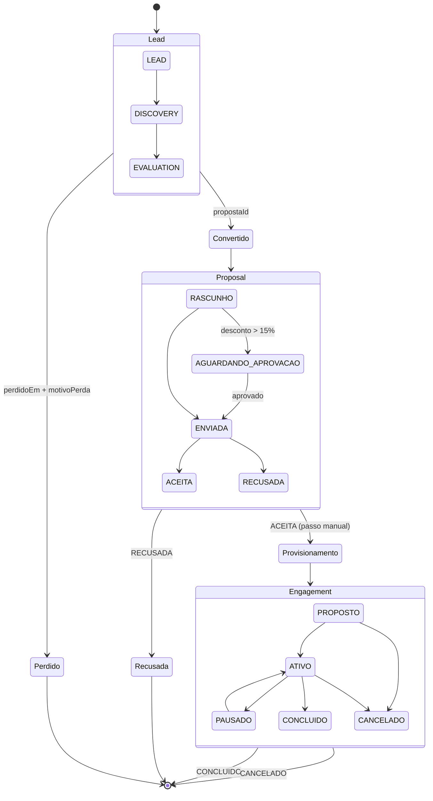

# Mapa de processo comercial

Da identificação de ICP até a entrega, ancorado no que o back-office já
implementa — não no que o processo deveria ser.

## 0. Como ler

Cada etapa abaixo tem entrada, saída, dono, a tela/entidade que a implementa e
o que falta; nada aqui repete o [ICP e precificação](icp-e-precificacao.md) ou
o [playbook de vendas](playbook-de-vendas.md) — só aponta para eles quando a
etapa depende do que está escrito lá.

---

## 1. Identificação de ICP

| | |
|---|---|
| Entrada | Lista bruta de prospects (evento, indicação, site) |
| Saída | `Lead` criado com `origem` e dono atribuído |
| Dono | Quem cadastra o lead — comercial ou RevOps |
| Onde no back-office | Tela `funil`, action `listarLeads`/`criarLead` em `apps/backoffice/app/actions/leads.ts` |
| O que falta | `origem` é texto livre, sem lista fechada de canal; não há captura automática vinda do site — todo lead entra por cadastro manual |

O ICP em si (quem qualifica como cliente-alvo, por produto) está descrito no
[ICP e precificação](icp-e-precificacao.md); esta etapa só registra o prospect
depois que ele bate com esse recorte.

---

## 2. Qualificação

| | |
|---|---|
| Entrada | `Lead` no estágio `LEAD` |
| Saída | Convertido (`propostaId` apontando para a `Proposal` criada) ou perdido (`perdidoEm` + `motivoPerda` preenchidos juntos) |
| Dono | Dono do lead (`donoId`/`donoNome`) |
| Onde no back-office | Campo `estagio` do `Lead` (`LEAD → DISCOVERY → EVALUATION → PROPOSAL`), tela `funil`, roteiro de discovery no [playbook de vendas](playbook-de-vendas.md) §1 |
| O que falta | Não há critério escrito de quando um lead passa de `DISCOVERY` para `EVALUATION` — a mudança de estágio é julgamento de quem toca o lead; `proximaAcao`/`proximaAcaoEm` marca atraso na tela, mas não dispara lembrete |

Quarto estágio, `PROPOSAL` ("Proposta"): o lead entra nele ao converter em
`EVALUATION` (`converterEmProposta`), fica vinculado a uma `Proposal`
(`propostaId`) e continua perdível até o fechamento. Peso, teto de dias e
critérios de saída de cada estágio (inclusive `PROPOSAL`) não são constante em
código — vivem em `EstagioDoFunil`, por tenant, editáveis no painel do
estágio (clique no cabeçalho da coluna, ADMIN) na tela `funil`; toda edição
grava uma linha em `MudancaDeEstagio` (campo, de, para, motivo, autor).

---

## 3. Precificação

| | |
|---|---|
| Entrada | Escopo negociado: assentos e desconto comercial, sobre o catálogo do cliente |
| Saída | `Preco` calculado (mensal, uma vez, ACV, TCV); se o desconto passar de 15%, a proposta não sai direto — vai para a fila de aprovação |
| Dono | Quem monta a proposta; RevOps aprova desconto acima do limite |
| Onde no back-office | `precificarProposta(catalogo, escopo)` em `apps/backoffice/lib/comercial/precificar.ts`, catálogo nas telas `servicos` e `propostas`, aprovação na tela `aprovacoes` |
| O que falta | Ticket do diagnóstico (SKU de entrada) — decisão em aberto, não código; CAC carregado não medido; Signal já tem preço de tabela (R$ 1.200) mas nenhuma linha de código o implementa |

`precificarProposta` é função pura: recebe `CatalogoParaPreco` (plano, módulos,
termo, add-ons, serviços) e `Escopo` (`{ assentos, descontoPercent }`), devolve
`Preco` sem tocar banco — é o mesmo cálculo que roda no preview da call, no
ACV do funil e na validação de envio, testado em
`apps/backoffice/__tests__/precificar.test.ts`. O limite de desconto é a
constante `LIMITE_DESCONTO_SEM_APROVACAO = 15` em `apps/backoffice/lib/comercial.ts`.
Detalhe do catálogo, ICP e as pendências financeiras (ticket, CAC) estão em
[ICP e precificação](icp-e-precificacao.md).

---

## 4. Proposta

| | |
|---|---|
| Entrada | Escopo já precificado, itens do catálogo |
| Saída | `Proposal` percorrendo `RASCUNHO → (AGUARDANDO_APROVACAO) → ENVIADA → ACEITA \| RECUSADA` |
| Dono | Quem monta e envia; o cliente decide aceite/recusa |
| Onde no back-office | Gerador em `apps/backoffice/app/(staff)/propostas/[id]/gerador.tsx`; envio em `submitProposalAction` (`apps/backoffice/app/actions/proposals.ts`); montagem de escopo em `apps/backoffice/app/actions/proposta-escopo.ts` |
| O que falta | Não existe ação no back-office que marque uma proposta `ENVIADA` como `ACEITA` ou `RECUSADA` — a tela só lê esses dois estados (`apps/backoffice/app/(staff)/propostas/page.tsx`), não há caminho de escrita para eles; também não há motivo estruturado de recusa nem validade/expiração da proposta |

`totalCentavos` e `acvCentavos` são congelados no momento do envio — o
catálogo pode mudar de preço depois sem alterar o que já foi prometido. Quando
o desconto passa de 15%, o envio não muda o status para `ENVIADA` direto: abre
um pedido em `PlatformApproval` e a proposta fica em `AGUARDANDO_APROVACAO`
até alguém liberar — esse é o quinto estado do campo, além dos três citados no
handoff original.

---

## 5. Contrato

| | |
|---|---|
| Entrada | Proposta `ACEITA` |
| Saída | Termo de contrato fechado (`TermoDeContrato`: prazo e desconto), DPA e, quando a call for gravada, consentimento registrado |
| Dono | Comercial fecha; jurídico valida DPA e consentimento |
| Onde no back-office | `TermoDeContrato` no catálogo (`apps/backoffice/app/(staff)/servicos/`, action `catalogo-comercial.ts`); modelos em [DPA](../compliance/dpa-modelo.md) e [consentimento de gravação](../compliance/consentimento-de-gravacao.md) |
| O que falta | Assinatura eletrônica não está implementada — o aceite hoje não tem um passo de assinatura no produto; RACI de quem assina pelo cliente e pela Nebuloz não está preenchido (ver §4 do playbook) |

O termo de contrato é só o prazo e o desconto que ele carrega (`meses`,
`descontoPercent`) — DPA e consentimento de gravação são documentos à parte,
tratados nos docs de compliance linkados acima, não em uma entidade do banco.

---

## 6. Provisionamento

| | |
|---|---|
| Entrada | Decisão de criar o cliente — hoje, o gatilho é a proposta aceita, aplicado manualmente |
| Saída | Tenant novo com os módulos contratados, Charter em bootstrap, staff exigido a ter 2FA para operar |
| Dono | Staff com permissão de escrita que provisiona o cliente |
| Onde no back-office | Tela `clientes/novo`, actions `clients.ts` e `provisioning.ts` sobre `@repo/provisioning`; 2FA obrigatório verificado em `requirePlatformStaff` (tela `seguranca`) |
| O que falta | `Proposal.status = ACEITA` não dispara provisionamento — mesmo se existisse a ação do item 4 para chegar lá, criar o tenant em `clientes/novo` é um passo manual separado, sem vínculo automático de volta à proposta além do campo `tenantProvisionadoSlug` |

O bootstrap do Charter interno faz parte deste passo — ver
[runbook do Charter](../runbooks/charter-nebuloz.md) para o procedimento
operacional completo.

---

## 7. Entrega

| | |
|---|---|
| Entrada | Tenant provisionado, escopo do serviço vendido |
| Saída | `Engagement` percorrendo `PROPOSTO → ATIVO → PAUSADO → CONCLUIDO \| CANCELADO` |
| Dono | Time de delivery/CS responsável pelo engajamento |
| Onde no back-office | Tela `delivery`; materialização a partir do Scaffold em `materializarEngajamento` (`apps/backoffice/app/actions/scaffold.ts`), tela `scaffold` |
| O que falta | Nada modela o fechamento do ciclo — a reavaliação de saúde/expansão do cliente no Meridian não está ligada de volta ao `Engagement` como evento que reabre ou encerra o processo comercial |

`Engagement` é escopo fechado, não alocação por hora: valor e entrega são
acordados na criação e não variam com o esforço gasto — quem mede esforço é a
alocação de pessoa (`StaffAllocation`), para saber se o escopo cabe, não para
faturar.

---

## 8. Diagrama de estados

---

## 9. Lacunas consolidadas

| Lacuna | Etapa | Tipo | Dono sugerido |
|---|---|---|---|
| Sem captura automática de lead a partir do site | 1. ICP | Código | Responsável pela entrega (RACI, produto a definir) |
| Sem critério escrito de passagem `DISCOVERY → EVALUATION` | 2. Qualificação | Decisão | Dono do roadmap comercial (RACI) |
| `proximaAcao` não gera lembrete | 2. Qualificação | Código | Responsável pela entrega (RACI) |
| Ticket do diagnóstico (SKU de entrada) sem definição | 3. Precificação | Decisão | Quem dirige a empresa — ver [ICP e precificação](icp-e-precificacao.md) §3 |
| CAC carregado não medido | 3. Precificação | Decisão | Dono do SLA / financeiro (RACI) |
| Signal precificado sem linha de código | 3. Precificação | Decisão | Dono do roadmap (RACI) — decisão de produto vendável vs. capacidade do Cosmos |
| Nenhuma ação marca proposta `ENVIADA` como `ACEITA`/`RECUSADA` | 4. Proposta | Código | Responsável pela entrega (RACI) |
| Sem motivo estruturado de recusa | 4. Proposta | Código | Responsável pela entrega (RACI) |
| Sem validade/expiração da proposta | 4. Proposta | Código | Dono do roadmap (RACI) |
| Assinatura eletrônica não implementada | 5. Contrato | Código | Responsável pela entrega (RACI) |
| RACI de quem assina o contrato não preenchido | 5. Contrato | Decisão | Quem dirige a empresa — ver [playbook de vendas](playbook-de-vendas.md) §4 |
| `ACEITA` não dispara provisionamento — passo manual | 6. Provisionamento | Código | Responsável pela entrega (RACI) |
| Reavaliação no Meridian não fecha o ciclo do `Engagement` | 7. Entrega | Decisão | Dono do roadmap (RACI, produto Meridian) |
| `Proposal.aceitaEm` ausente — a tela de CAC conta "clientes ganhos" por `atualizadoEm` das propostas `ACEITA`, que é aproximação: qualquer edição posterior muda o mês; sem timestamp do aceite, o denominador do CAC é sugestão, não contagem (spec das telas Empresa, §2.4) | 4. Proposta | Código | Responsável pela entrega (RACI) |
| `Proposal.previsaoFechamentoEm` ausente — sem data prevista, o pipeline ponderado do caixa de 13 semanas não se distribui por semana sozinho: entra à mão, com o total ponderado como referência (spec das telas Empresa, §2.5) | 4. Proposta | Código | Responsável pela entrega (RACI) |
